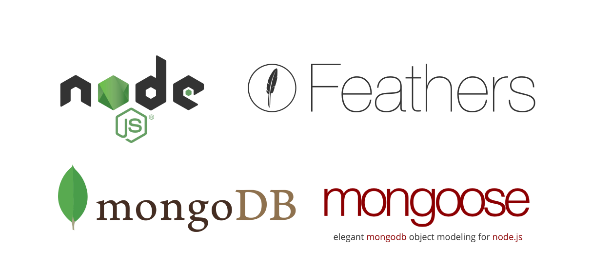
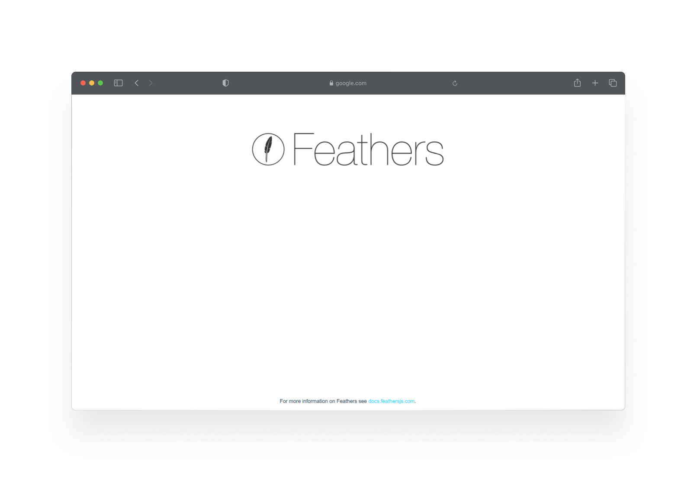

RESTful API on FeathersJS with MongoDB database

## Tech stack

- **[NodeJS]** - Node.js® is a JavaScript runtime built on Chrome's V8 JavaScript engine.
- **[MongoDB]** - Database
- **[Mongoose]** - Elegant mongodb object modeling for node.js
- **[TypeScript]** - TypeScript extends JavaScript by adding types to the language.
- **[FeathersJS]** - A framework for real-time applications and REST APIs

 

Made with love ❤️

I'm on Telegram: **@ssandry0** \
I'm on Behance: **https://www.behance.net/aftertaste** \
I'm on Dribbble: **https://dribbble.com/ssandry0**

[nodejs]: https://nodejs.org/en/
[mongodb]: https://www.mongodb.com/
[mongoose]: https://mongoosejs.com/docs/
[typescript]: https://www.typescriptlang.org/
[feathersjs]: https://feathersjs.com/
